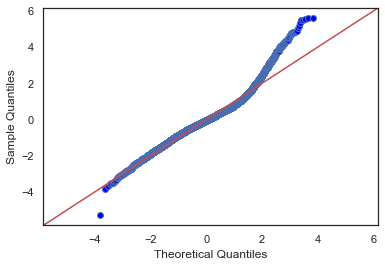
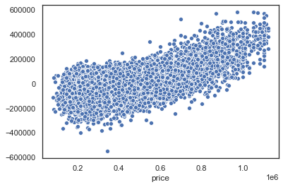
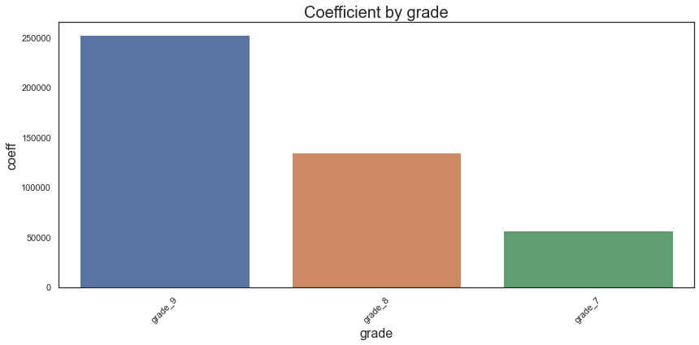
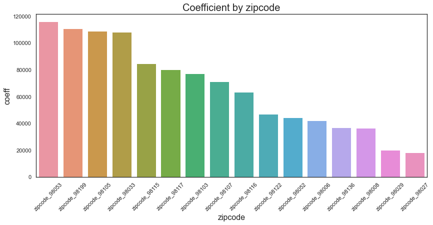

# Determining Most Significant Features in House Sale
## What features drive the sale price of a house in King County, WA?

**Author**: Jeff Spagnola

The contents of this repository detail an analysis of the Module 2 Project of the Data Science program at Flatiron School. This analysis is detailed in hopes of making the work accessible and replicable.

<center></center>

### Business problem:

In this notebook, we will be examining data from house sales in King County, Washington in order to determine what a potential seller may be able to do in order to increase the final sale price of their home. While there are many factors at play when it comes to home value, we will attempt to figure out key features that drive sale price using data scrubbing and linear regression models.

In this notebook, we will answer several questions:

Is the dataset affected by the presence of outliers?
Are there issues of data being encoded as the wrong type?
Will our initial model be affected by multicolinearity?
Most importantly, what features drive the overall sale price of a house in King County?


### Data
For this project, we were tasked with analyzing the [King County House Data dataset](./kc_house_data.csv).  This dataset included 21,597 observations on the housing market in King County, WA. 

Below are the column descriptions that were given along with the dataset:
 - id - A notation for a house
 - date - Date house was sold
 - price - Price is prediction target
 - bedrooms Number of Bedrooms/House
 - bathrooms - Number of bathrooms/bedrooms
 - sqft_living - Square footage of the home
 - sqft_lot - Square footage of the lot
 - floors - Total floors (levels) in house
 - waterfront - House which has a view to a waterfront
 - view - Has been viewed
 - condition - How good the condition is ( Overall )
 - grade - Overall grade given to the housing unit, based on King County grading system
 - sqft_above - square footage of house apart from basement
 - sqft_basement - square footage of the basement
 - yr_built - Built Year
 - yr_renovated - Year when house was renovated
 - zipcode - Zipcode
 - lat - Latitude coordinate
 - long - Longitude coordinate
 - sqft_living15 - Living room area in 2015 (implies-- some renovations) This might or might not have affected the lotsize area
 - sqft_lot15 - Lot size area in 2015 (implies-- some renovations)


## Methods
For this project, we used the OSEMN data science process to achieve the best results.  Let's walk through the methods used to obtain our results. 

### Obtain
Obtaining the data was super simple but I can't, in good conscience, skip over the 'O' in OSEMN.  Therefore, let's dig into importing the data. 

```python
df = pd.read_csv('kc_house_data.csv')
pd.set_option('display.max_columns', 0)
pd.set_option('display.float_format', lambda x: '%.3f' % x)
df.head()
``` 

### Scrub
Cleaning this dataset was fairly straight forward.  The first thing done was dropping the id column as it had no bearing on the overall data.  After this, I dealt with the weird values within the sqft_basement column and converted that from an object to a float.  

```
df['sqft_basement'].replace('?', np.nan, inplace = True) 
df['sqft_basement'] = df['sqft_basement'].astype('float') 
```

Then, I converted the date column from a string to a datetime and created several new columns out of it: sales_day, sales_month, and house_age.

```
df['date'] = pd.to_datetime(df['date']) # convert date column from string to datetime
df['sales_year'] = df['date'].dt.year
df['sales_month'] = df['date'].dt.month # create a column show month of sale
df['sales_day'] = df['date'].dt.dayofweek # create a column to show day of sale
df['house_age'] = df['sales_year'] - df['yr_built']
df.drop(['sales_year', 'yr_built'], axis = 1, inplace = True)
```

The next step was to change yr_renovated, which was full of 0 values, into 'was_renovated' with a simple binary value.  Last scrubbing step was to deal with the remaining null values.  This left us with a clean dataset.


### Explore
During the exploration phase, we posed three questions.
- Are there any outliers that may affect our model?
- Could any of our numerical columns be categorical?
- Are there any multicolinearity issues? 

The answer to all these questions was a resounding <b><u>YES</u></b>.

#### Outlier Removal
In order to address outliers, we decided to use the IQR method and created the following functions.  
```
def outliers_range_iqr(df, column, distance = 1.5):
    # Finds the iqr range of a column
    iqr = df[column].quantile(0.75) - df[column].quantile(0.25)
    lower_threshold = df[column].quantile(0.25) - (iqr * distance)
    upper_threshold = df[column].quantile(0.75) + (iqr * distance)
    return lower_threshold, upper_threshold

def find_outliers_iqr(df, column):
    # Identifiest the outliers in a column
    lower_threshold, upper_threshold = outliers_range_iqr(df, column)
    outliers = []
    for i in df[column]:
        if i > upper_threshold:
            outliers.append(i)
        elif i < lower_threshold:
            outliers.append(i)
        else: 
            pass
    return outliers

def remove_outliers_iqr(df, column):
    # Removes the outliers in a column
    outliers = find_outliers_iqr(df, column)
    outliers = pd.Series(outliers)
    df_new = df[~df[column].isin(outliers)]
    return df_new
```
#### Categorical Columns
While exploring the dataset for potential categorical columns, we wound up figuring out that sqft_basement made more sense as 'has_basement' with a binary value.  While using a variety of plots to check out the distributions of the values, it was determined that zipcode, has_basement, condition, and grade made more sense as categorical columns.  The next step in the process was to separate categorical and numerical columns and one-hot encode the categorical columns. 
```
df_dummies = df.copy()
df_dummies = pd.get_dummies(df, columns = cat_cols, drop_first = True)
print(df_dummies.shape)
df_dummies.head()
```

#### Multicolinearity
Using feature selection to address multicolinearity proved to be a tricky, multi-step process.  We began by removing correlated features using the following function: 
```
def correlation(df, threshold):
    # Checks for correlated features
    col_corr = set() # set of corellated columns
    corr_matrix = df.corr()
    for i in range(len(corr_matrix.columns)):
        for j in range(i):
            if abs(corr_matrix.iloc[i, j]) > threshold:
                col_name = corr_matrix.columns[i]
                col_corr.add(col_name)
    return col_corr
```
Next, we ran tests for the Variance Inflation Factor to determine more features that could be removed and then finished up the feature selection process by also removing quasi-correlated features. 


### Model
At this point, it was time for us to begin modeling our data.  First, I ran a baseline model of the dataframe with Statsmodels OLS linear regression.  
```
# Running a baseline model 
features = '+'.join(df_dummies.drop('price', axis = 1).columns)
formula = 'price ~' + features
model = smf.ols(formula, df_dummies).fit()
model.summary()
```
This baseline produced an r-squared of 0.682 and also showed several insignificant p-values.  After removing the features associated with the insignificant p-values, I ran an identical model to make sure everything still looked okay.  

#### Model Validation
In order to validate the accuracy of this model, I separated the data into train and test sets and ran each.  At this point, the train set returned an r-squared of 0.676 and the test set produced an r-squared of 0.699.  Despite the passable r-squared, the QQ-plots and scatter plots produced for both did still show some irregularities.  My attempts to address normality and homoscedasticity are still ongoing and I hope to improve on this model in the future.  

##### QQ Plot

> This is the QQ Plot of the model.  

##### Scatter Plot

> This scatterplot is to check for homoscedasticity.  


The next step in model validation was to run a scikit-learn cross validation test on the model.  There was a lot of blood, sweat, and tears put into getting Statsmodels and Scikit-learn to play nice with each other and we were able to get some guidance on this from <a href="https://sukhbinder.wordpress.com/2018/08/07/cross-validation-score-with-statsmodels/">this helpful blog.</a>.  Once we were able to get that squared (or r-squared...terrible) away, we ran the Cross Validation test and found our score to be 0.678.  
```
X = df_dummies.drop(['price'], axis = 1)
y = df_dummies['price']
print(cross_val_score(SMWrapper(sm.OLS), X, y, scoring='r2'))
print(cross_val_score(LinearRegression(),X, y, scoring='r2'))

cv_ols = cross_val_score(SMWrapper(sm.OLS), X, y, scoring='r2')
print('Cross Validation Score: {}'.format(cv_ols.mean()))
```

### Interpret
After settling on a certain level of satisfaction with the model, we pulled the coefficients for each feature into a dataframe to further analyze which features affect the overall sale price the most.  The top 5 features that drive house sale prices the most are <b>zipcode, grade, condition, bathrooms, and basement.</b>


## Results
After reviewing the data, we have found that the features that are most important in driving the sale price are <b>Grade, Zipcode, Bathrooms, Basement, and Condition. </b>
    
  - <b> Grade: </b> The grade given by the King County Housing Authority is the largest contributor to overall sale price.  The best return on investment in terms of grade occurs within a grade range of 7-9, with the highest sale prices graded as a 9.  A grade within 7-9 will increase the sale price, on average, by 148,018.74 <br><br>
  - <b> Zipcode: </b> While we can't ask sellers to physically move their homes, we've discovered that houses located within certain zipcodes sell for substantially more than others.  Location is definitely something to consider. If your house is located in one of the top zipcodes, you can expect an average increase of 66,629.05<br><br>
  - <b> Bathrooms: </b> We found that number of bathrooms is a feature that can increase the sale price of a house considerably.  Each bathroom present within the house is worth 40,018.49 toward the sale price. <br><br>
  - <b> Basement: </b> The presence of a basement in the house is another feature that added considerable value.  If a house in King County has a basement, the sale price is expected to increase by 25,934.89 <br><br>
  - <b> Condition: </b> The overall condition of the house also tends to affect the sale price.  If a house has a perfect 5 condition grade, it will add 23,521.84 to the sale price.  

### Result Plots

#### Top 5 Features

> This barplot shows the top 5 features and their level of coefficients.  

#### Coefficient by Grade

> This barplot shows the coefficients of grades 7-9.  

#### Coefficient by Top Zipcodes

> This barplot shows the coefficients of the top zipcodes.  

## Recommendations:

Based on the results of this analysis, we have the following recommendations:

 - Aim for having a <b>Grade</b> of 9.  According to the King County Housing Authority, this would require having "Better architectural design with extra interior and exterior design and quality." <br><br>
 - If possible, increase the amount of <b>Bathrooms</b> in your house. <br><br>
 - If possible, consider creating a <b>Basement</b> or equivalent.<br><br>
 - Make sure your house is able to achieve a 5 in <b>Condition</b> grade.  According to the King County Housing Authority, this would require "All items well maintained, many having been overhauled and repaired as they have shown signs of wear, increasing the life expectancy and lowering the effective age with little deterioration or obsolescence evident with a high degree of utility."


## Future Work
With more time, we can do better work and also look at several other factors that could potentially drive the sale price much higher.  These include: 

<b><u> Timing: </b></u> <br>  Is there a trend in your neighborhood?  If the market is on the rise in your zipcode, it may be worth waiting til the optimal moment to put the house on the market.

<b><u> Investment Properties: </b></u> <br>  Are there houses in King County that could see a huge return on investment with minor renovations?

<b><u> Creating a Pipeline:</b></u> <br>
Creating a pipeline will make this notebook much easier to read as well as make it more readily available to be used again with new data. 


### For further information
Please review the narrative of our analysis in [our jupyter notebook](./student.ipynb) or review our [presentation](./Mod-2 Project.pdf)

For any additional questions, please contact jeff.spags@gmail.com)


##### Repository Structure:

Here is where you would describe the structure of your repoistory and its contents, for exampe:

```

├── README.md                       <- The top-level README for reviewers of this project.
├── student.ipynb             <- narrative documentation of analysis in jupyter notebook
├── presentation.pdf                <- pdf version of project presentation
└── images
    └── images                          <- both sourced externally and generated from code

```
